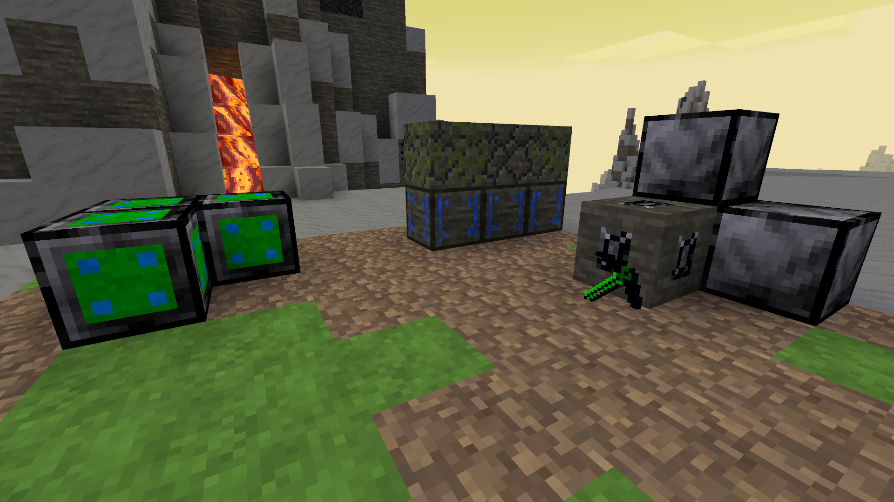

# Minetest Mod: hades_endgame

Adds lategame stuff to [Hades Revisited](https://codeberg.org/Wuzzy/Hades_Revisited)

* Onyx (worth 2 Diamonds ~ 16 Emeralds)
* Onyx Pickaxe (better than Prism Pickaxe)
* Void Pickaxe (better than Onyx Pickaxe)
* Higher Ore density far down, generation maxes out at Y -28k ([hades_travelnet](https://content.minetest.net/packages/SFENCE/hades_travelnet) recommended)
* Moister for making efficient Moss farms
* Revival Item to supress death
* Grassifier to get grassy landscapes more easily

Assets used are derivatives of assets from [Hades Revisited](https://codeberg.org/Wuzzy/Hades_Revisited) (CC BY-SA 3.0), see [LICENSE_MEDIA](./LICENSE_MEDIA)